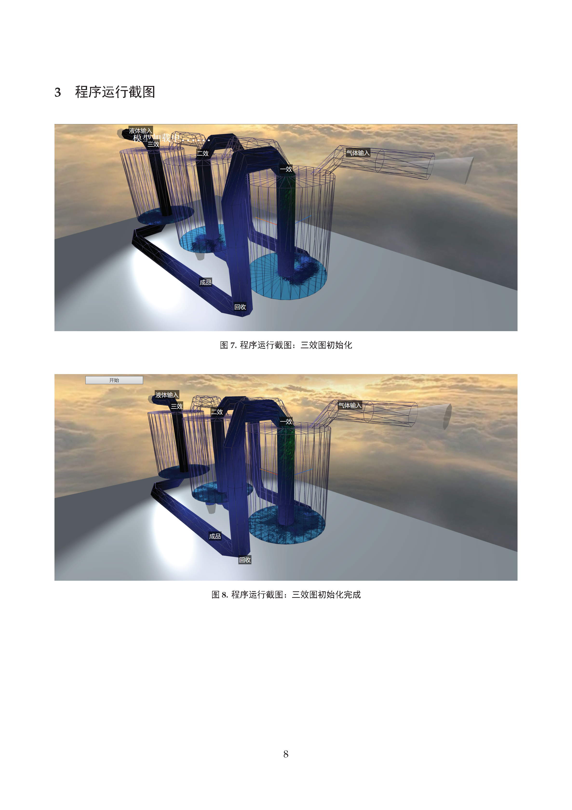
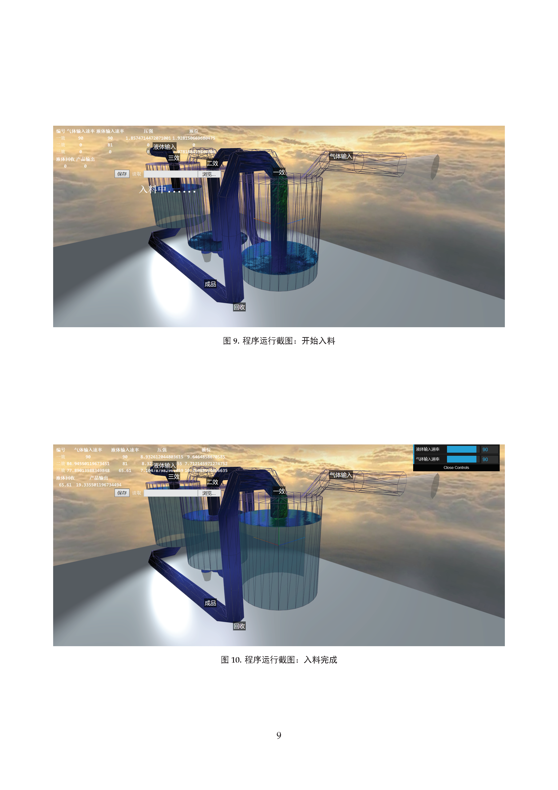
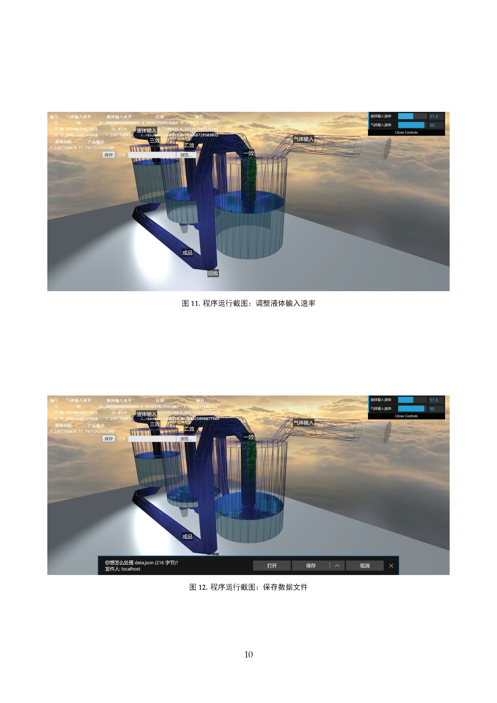
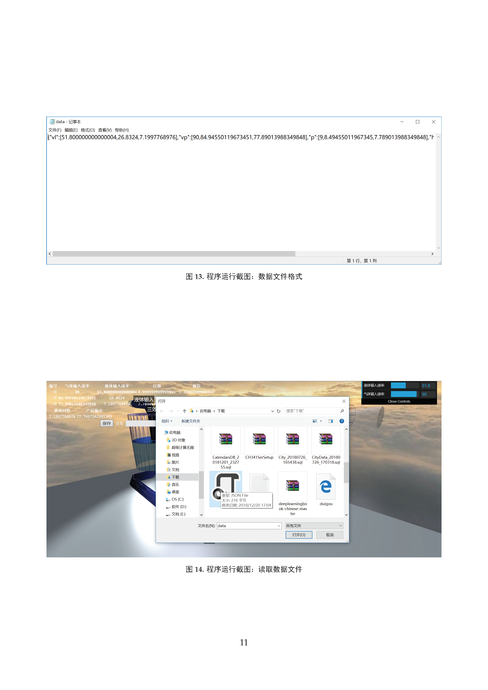

# Three-effect-reaction-Simulator

一个用java servlet和three.js制作的3D三效反应模拟器

[threejs官网](https://threejs.org/)👈墙裂推荐，真的震撼

👆浏览器3D渲染都做出来了，还有什么做不出来的？感觉仿佛看到了未来移动应用的样子

👆唯一的缺点，一个网页几百M，没进5G时代享受不来

## 使用方法

1. 下载此工程
2. 作为Gradle工程导入IDEA或Eclipse(Eclipse需要下载Gradle插件)
3. 刷新Gradle工程
4. 运行Gradle Tasks→gretty→appRun
5. 按照控制台输出指示打开浏览器查看网页或关闭服务器

## 运行效果

